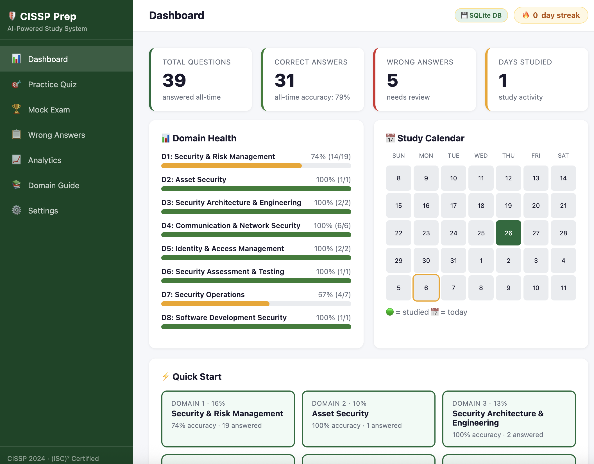
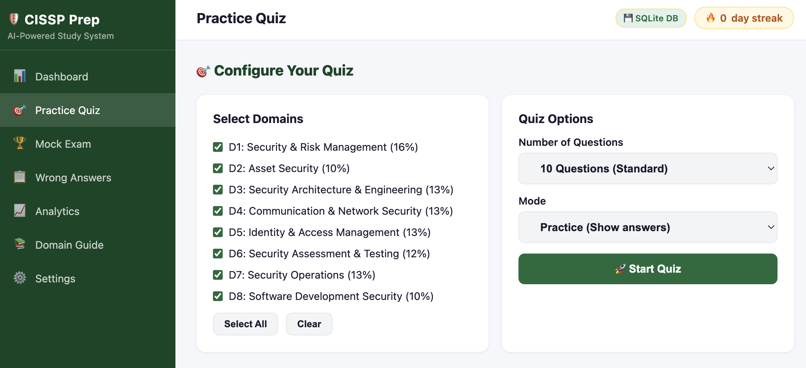
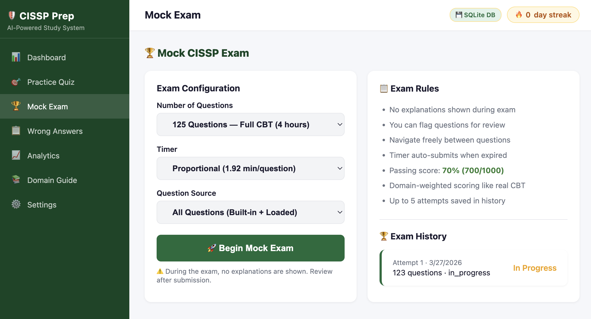
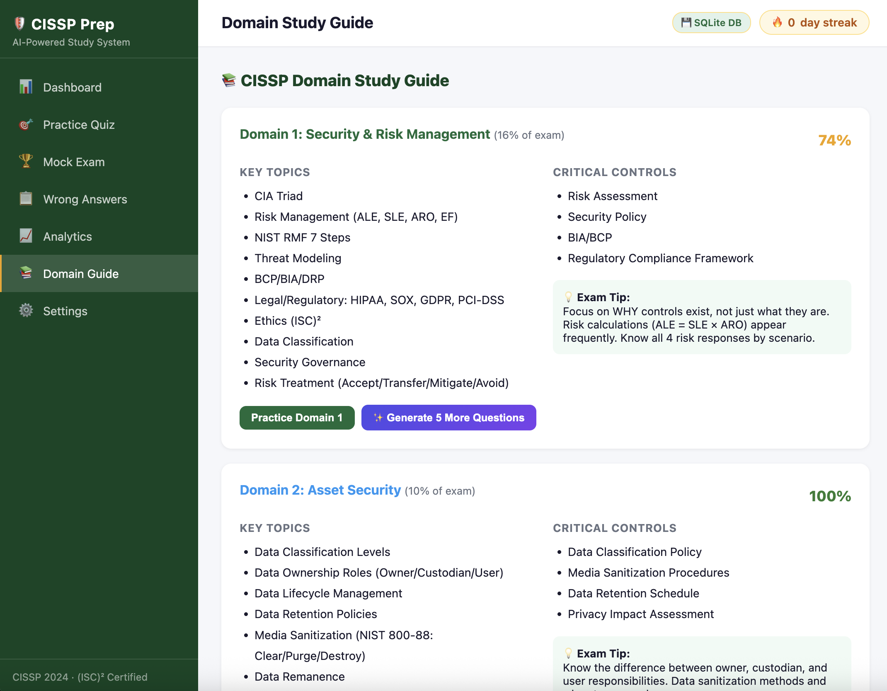
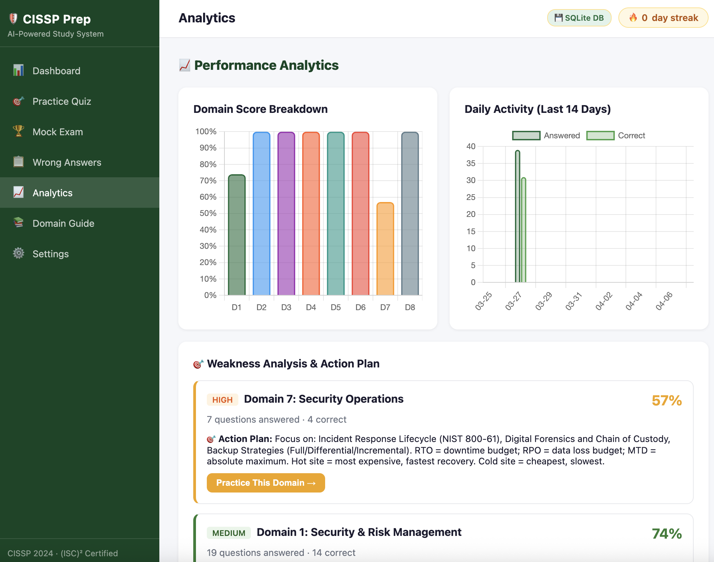
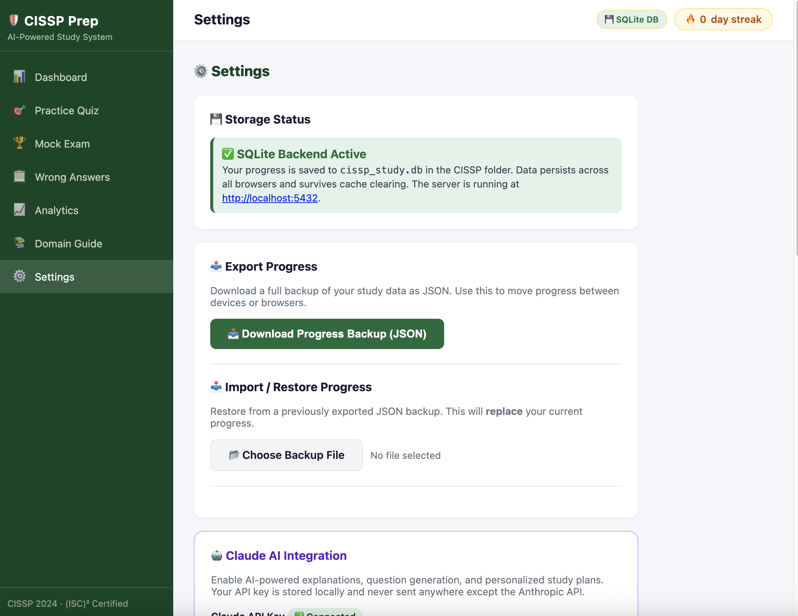
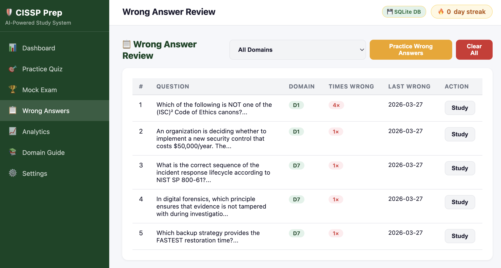

# 🛡️ CISSP Study App

An AI-powered, offline-first CISSP exam preparation tool with a **4-hour CBT mock exam simulator**, **multi-LLM support**, and **260+ scenario-based practice questions** — all running locally with zero cloud dependencies beyond your chosen AI provider.

---

## Screenshots

| Dashboard | Practice Quiz | Mock Exam |
|-----------|--------------|-----------|
|  |  |  |

| Domain Guide | Analytics | Settings | Wrong Answers |
|-------------|-----------|----------|---------------|
|  |  |  |  |

---

## Table of Contents

1. [Features](#-features)
2. [Architecture Overview](#-architecture-overview)
3. [System Architecture Diagram](#-system-architecture-diagram)
4. [Data Flow Diagrams](#-data-flow-diagrams)
5. [Project Structure](#-project-structure)
6. [REST API Reference](#-rest-api-reference)
7. [Question Bank](#-question-bank)
8. [LLM Providers](#-llm-providers)
9. [Mock Exam System](#-mock-exam-system)
10. [How to Run](#-how-to-run)
11. [Configuration](#-configuration)
12. [Security & Privacy](#-security--privacy)
13. [Contributing](#-contributing)
14. [Branch Strategy](#-branch-strategy)

---

## ✨ Features

| Feature | Description |
|---------|-------------|
| 🏆 **Mock Exam CBT Simulator** | 4-hour countdown, 25/50/125 questions, domain-weighted sampling, 5 saved attempts |
| 🧠 **AI Explanations** | Ask any LLM to explain why an answer is correct/incorrect after each question |
| 📅 **AI Study Plan Generator** | Personalized weekly schedule targeting your weakest domains first |
| 🔄 **Domain Question Generator** | Generate 5 new AI-crafted questions for any domain on demand |
| 📊 **Performance Analytics** | Per-domain accuracy, wrong-answer review, trend tracking |
| 🌐 **Multi-LLM Support** | Claude, Gemini, Ollama (local/offline), OpenAI, MiniMax, Qwen |
| 💾 **Dual Persistence** | SQLite when server is running; localStorage fallback for offline use |
| 🔒 **Privacy First** | API keys stored locally, never transmitted beyond your chosen provider |
| 📤 **Export** | Export study progress as JSON; export study plan to CSV/Excel |

---

## 🏗️ Architecture Overview

The app follows a **single-file frontend + local Python backend** architecture:

```
┌─────────────────────────────────────────────────┐
│                 Browser (Client)                │
│                                                 │
│  ┌─────────────────────────────────────────┐    │
│  │      CISSP_Study_App.html               │    │
│  │  • Vanilla JS SPA (no framework)        │    │
│  │  • 60 built-in practice questions       │    │
│  │  • localStorage fallback               │    │
│  │  • All UI: quiz, mock exam, analytics  │    │
│  └──────────────────┬──────────────────────┘    │
└─────────────────────┼───────────────────────────┘
                      │ HTTP REST (localhost:5432)
                      ▼
┌─────────────────────────────────────────────────┐
│             cissp_server.py (Python 3)          │
│                                                 │
│  ┌──────────┐  ┌──────────┐  ┌──────────────┐  │
│  │ HTTP     │  │ SQLite3  │  │  Question    │  │
│  │ Server   │  │ Backend  │  │  Cache       │  │
│  │ :5432    │  │          │  │  (in-memory) │  │
│  └────┬─────┘  └────┬─────┘  └──────┬───────┘  │
│       │             │               │           │
│  ┌────▼─────────────▼───────────────▼───────┐  │
│  │           call_llm() Dispatcher           │  │
│  └────┬──────────┬──────────┬────────────────┘  │
│       │          │          │                   │
│  ┌────▼──┐  ┌───▼───┐  ┌───▼────────────────┐  │
│  │Claude │  │Gemini │  │OpenAI-Compatible   │  │
│  │ API   │  │ API   │  │(Ollama/MiniMax/    │  │
│  └───────┘  └───────┘  │ Qwen/OpenAI)       │  │
│                         └────────────────────┘  │
└─────────────────────────────────────────────────┘
                      │
            ┌─────────▼───────┐
            │  questions/     │
            │  *.json files   │
            │  (200 advanced  │
            │   questions)    │
            └─────────────────┘
```

### Key Design Decisions

| Decision | Rationale |
|----------|-----------|
| Single-file HTML | Zero build step, portable, share with one file |
| Python stdlib only | No `pip install` required — works anywhere Python 3 runs |
| SQLite3 backend | Persistent local storage with full SQL querying power |
| In-memory question cache | JSON files loaded once per server session, no repeated I/O |
| localStorage fallback | App remains usable when server is offline |
| Multi-LLM abstraction | Users are not locked into one provider; free/local options available |

---

## 📐 System Architecture Diagram

```
╔══════════════════════════════════════════════════════════════════════╗
║                    CISSP Study App — Full System                    ║
╠══════════════════════════════════════════════════════════════════════╣
║                                                                      ║
║  ┌─────────────────── Frontend SPA ──────────────────────────────┐  ║
║  │                                                                │  ║
║  │  Navigation Pages                                             │  ║
║  │  ┌──────────┐ ┌──────────┐ ┌───────────┐ ┌───────────────┐  │  ║
║  │  │ Practice │ │  Mock    │ │  Wrong    │ │   Analytics   │  │  ║
║  │  │   Quiz   │ │  Exam    │ │  Answers  │ │   & Domains   │  │  ║
║  │  └────┬─────┘ └────┬─────┘ └─────┬─────┘ └───────┬───────┘  │  ║
║  │       │            │             │               │           │  ║
║  │  ┌────▼────────────▼─────────────▼───────────────▼────────┐  │  ║
║  │  │              State Manager (JS module)                  │  │  ║
║  │  │  • currentQuestion   • mockExam object                 │  │  ║
║  │  │  • quiz progress     • sessionHistory                  │  │  ║
║  │  │  • domain filters    • studyPlanData                   │  │  ║
║  │  └─────────────────────────────────────────────────────────┘  │  ║
║  │                                                                │  ║
║  │  ┌──────────────────────────────────────────────────────────┐  │  ║
║  │  │                  API Client Layer                        │  │  ║
║  │  │  apiCall(method, path, body) → JSON                     │  │  ║
║  │  │  Falls back to localStorage on connection error         │  │  ║
║  │  └────────────────────────┬─────────────────────────────────┘  │  ║
║  └───────────────────────────┼────────────────────────────────────┘  ║
║                              │                                       ║
║         ┌────────────────────▼─────────────────────────┐            ║
║         │           REST API (Python HTTP Server)       │            ║
║         │                                               │            ║
║         │  GET  /api/ping           Health check        │            ║
║         │  GET  /api/state          Load progress       │            ║
║         │  GET  /api/history        Session history     │            ║
║         │  GET  /api/config         LLM config          │            ║
║         │  GET  /api/questions      Question bank       │            ║
║         │  GET  /api/mock-exam/history  Past exams      │            ║
║         │  GET  /api/mock-exam/{id}     Exam detail     │            ║
║         │                                               │            ║
║         │  POST /api/answer         Save answer         │            ║
║         │  POST /api/import         Import progress     │            ║
║         │  POST /api/clear-wrong    Clear wrong list    │            ║
║         │  POST /api/config         Save LLM config     │            ║
║         │  POST /api/mock-exam/start    New exam        │            ║
║         │  POST /api/mock-exam/submit   Grade exam      │            ║
║         │  POST /api/claude/explain     AI explanation  │            ║
║         │  POST /api/claude/generate-questions          │            ║
║         │  POST /api/claude/study-plan                  │            ║
║         └───────────────┬───────────────────────────────┘            ║
║                         │                                            ║
║    ┌────────────────────┼──────────────────────────────────────┐     ║
║    │                    │   Persistence Layer                  │     ║
║    │  ┌─────────────────▼─────────────────────────────────┐   │     ║
║    │  │                SQLite Database                    │   │     ║
║    │  │  ┌─────────────┐   ┌────────────┐                │   │     ║
║    │  │  │ quiz_history │   │ wrong_q's  │                │   │     ║
║    │  │  │  (answers)  │   │  (review)  │                │   │     ║
║    │  │  └─────────────┘   └────────────┘                │   │     ║
║    │  │  ┌─────────────┐   ┌────────────┐                │   │     ║
║    │  │  │  mock_exams │   │explanations│                │   │     ║
║    │  │  │  (history)  │   │  (cache)   │                │   │     ║
║    │  │  └─────────────┘   └────────────┘                │   │     ║
║    │  └───────────────────────────────────────────────────┘   │     ║
║    │                                                           │     ║
║    │  ┌──────────────────────────────────────────────────┐    │     ║
║    │  │         Question File Cache (in-memory)          │    │     ║
║    │  │    questions/domain1_*.json  (25 questions)      │    │     ║
║    │  │    questions/domain2_*.json  (25 questions)      │    │     ║
║    │  │    ...                       ...                 │    │     ║
║    │  │    questions/domain8_*.json  (25 questions)      │    │     ║
║    │  │    Total: 200 advanced scenario-based questions  │    │     ║
║    │  └──────────────────────────────────────────────────┘    │     ║
║    └───────────────────────────────────────────────────────────┘     ║
╚══════════════════════════════════════════════════════════════════════╝
```

---

## 🔄 Data Flow Diagrams

### 1. Practice Quiz Flow

```
User selects domain / question
         │
         ▼
  loadQuestion()
         │
    ┌────▼─────────────────────────────┐
    │  Question Sources (in priority)  │
    │  1. Built-in 60 questions (HTML) │
    │  2. questions/*.json (200 adv.)  │
    │  3. AI-generated (on demand)     │
    └────┬─────────────────────────────┘
         │
         ▼
  User picks answer
         │
    ┌────▼────────────────────────────────┐
    │  POST /api/answer                   │
    │  {qId, domain, correct, answer}     │
    └────┬────────────────────────────────┘
         │
    ┌────▼────────────────────────────────┐
    │  SQLite: quiz_history + wrong_q's   │
    │  UPDATE domain accuracy counters    │
    └────┬────────────────────────────────┘
         │
         ▼
  Show result + "Ask AI" button
         │ (optional)
    ┌────▼────────────────────────────────┐
    │  POST /api/claude/explain           │
    │  → call_llm() dispatcher           │
    │  → Claude / Gemini / Ollama / etc  │
    │  → Cache explanation in SQLite      │
    └─────────────────────────────────────┘
```

### 2. Mock Exam Flow

```
User clicks "Start Mock Exam"
         │
    ┌────▼────────────────────────────────┐
    │  POST /api/mock-exam/start          │
    │  {questionCount: 125, duration: 240}│
    └────┬────────────────────────────────┘
         │
    ┌────▼────────────────────────────────────────────────────┐
    │  Domain-Weighted Sampling                               │
    │  D1: 16% → 20 q   D2: 10% → 13 q   D3: 13% → 16 q    │
    │  D4: 13% → 16 q   D5: 13% → 16 q   D6: 12% → 15 q    │
    │  D7: 13% → 16 q   D8: 10% → 13 q                      │
    │  Pool: built-in 60 + 200 JSON = 260 total questions     │
    └────┬────────────────────────────────────────────────────┘
         │
    ┌────▼─────────────────────────────────┐
    │  SQLite: INSERT mock_exams row       │
    │  status = in_progress               │
    │  question_ids=[...], answers={}     │
    └────┬─────────────────────────────────┘
         │
         ▼
  4-hour countdown timer starts
  Free navigation + question flagging
  No explanations shown during exam
         │
  User submits (or timer expires)
         │
    ┌────▼──────────────────────────────────────────┐
    │  POST /api/mock-exam/submit                   │
    │  {examId, answers: {qId: answerIndex}}        │
    └────┬──────────────────────────────────────────┘
         │
    ┌────▼──────────────────────────────────────────┐
    │  Grade: compare answers vs correct answers    │
    │  Calculate domain breakdown %                 │
    │  Pass threshold: 70% overall                  │
    │  UPDATE mock_exams: score, status=completed   │
    └────┬──────────────────────────────────────────┘
         │
         ▼
  Show results + domain breakdown
  Full review mode (all Q + explanations)
  Saved to history (max 5 attempts)
```

### 3. Multi-LLM Request Flow

```
Frontend calls POST /api/claude/explain
                  │
         ┌────────▼────────────────────────┐
         │  load_config() → cissp_config.json
         │  provider: "claude" | "gemini"  │
         │           | "ollama" | "openai" │
         └────────┬────────────────────────┘
                  │
         ┌────────▼────────────────────────┐
         │       call_llm() dispatcher     │
         └────┬──────┬──────────┬──────────┘
              │      │          │
    ┌─────────▼──┐ ┌─▼────────┐ ┌▼────────────────────┐
    │call_claude()│ │call_     │ │call_openai_compat() │
    │            │ │gemini()  │ │                     │
    │ Anthropic  │ │ Google   │ │ Ollama (localhost)  │
    │ API        │ │ AI API   │ │ OpenAI API          │
    │ claude-*   │ │ gemini-* │ │ MiniMax API         │
    │            │ │          │ │ Qwen API            │
    └─────────┬──┘ └─┬────────┘ └┬────────────────────┘
              │      │            │
              └──────┴────────────┘
                     │
              Returns (text, error)
                     │
         ┌───────────▼─────────────────────┐
         │  _parse_llm_json() if needed    │
         │  Cache result in SQLite         │
         │  Return JSON to frontend        │
         └─────────────────────────────────┘
```

### 4. Study Plan Generation Flow

```
User clicks "Regenerate Plan"
         │
    ┌────▼──────────────────────────────────┐
    │  Collect domainStats from SQLite      │
    │  {D1: {answered: 15, correct: 11}, …} │
    └────┬──────────────────────────────────┘
         │
    ┌────▼──────────────────────────────────┐
    │  POST /api/claude/study-plan          │
    │  {domainStats, targetDate}            │
    └────┬──────────────────────────────────┘
         │
    ┌────▼──────────────────────────────────┐
    │  call_llm() → AI provider             │
    │  Prompt: domain performance data      │
    │  + target exam date                   │
    │  → Returns raw JSON (no code fences)  │
    └────┬──────────────────────────────────┘
         │
    ┌────▼──────────────────────────────────┐
    │  _parse_llm_json()                    │
    │  Strategy 1: strip code fences        │
    │  Strategy 2: direct JSON.parse        │
    │  Strategy 3: regex extract {...}      │
    │  Strategy 4: regex extract [...]      │
    └────┬──────────────────────────────────┘
         │
    ┌────▼──────────────────────────────────┐
    │  renderStudyPlan(data)                │
    │  • Readiness Assessment card          │
    │  • Priority Order list                │
    │  • Weekly Plan accordion              │
    │  • Export to CSV / Excel buttons      │
    └───────────────────────────────────────┘
```

---

## 📁 Project Structure

```
Mock-CISSP-App/
│
├── CISSP_Study_App.html          # Single-file frontend SPA (2,695 lines)
│   ├── <style>                   #   All CSS (dark/light theme, responsive)
│   ├── <body>                    #   All HTML pages (quiz, mock exam, settings...)
│   └── <script>                  #   All JavaScript (quiz engine, API client, UI)
│
├── cissp_server.py               # Python 3 backend (1,032 lines, stdlib only)
│   ├── Config management         #   load_config(), save_config()
│   ├── Question file loader      #   load_question_files() with in-memory cache
│   ├── SQLite init               #   init_db() — creates all tables
│   ├── LLM abstraction layer     #   call_llm(), call_claude(), call_gemini()...
│   ├── Quiz handlers             #   handle_answer(), handle_history()...
│   ├── AI handlers               #   handle_claude_explain(), study_plan()...
│   ├── Mock exam handlers        #   start_mock_exam(), submit_mock_exam()...
│   └── HTTP router               #   do_GET(), do_POST() dispatch
│
├── questions/                    # Advanced scenario-based question bank
│   ├── domain1_security_risk_management.json   # 25 questions (IDs 1001–1025)
│   ├── domain2_asset_security.json             # 25 questions (IDs 2001–2025)
│   ├── domain3_security_architecture.json      # 25 questions (IDs 3001–3025)
│   ├── domain4_network_security.json           # 25 questions (IDs 4001–4025)
│   ├── domain5_iam.json                        # 25 questions (IDs 5001–5025)
│   ├── domain6_security_assessment.json        # 25 questions (IDs 6001–6025)
│   ├── domain7_security_operations.json        # 25 questions (IDs 7001–7025)
│   └── domain8_software_security.json          # 25 questions (IDs 8001–8025)
│
├── docs/                         # PDCA documentation
│   ├── 03-analysis/              #   Gap analysis reports
│   └── 04-report/                #   Completion reports
│
├── .gitignore                    # Excludes DB, API keys, __pycache__
├── HOW_TO_RUN.txt                # Quick-start reference card
├── START_CISSP_APP.command       # macOS double-click launcher
└── README.md                     # This file

# Generated at runtime (gitignored — never commit these):
├── cissp_study.db                # SQLite database (your personal progress)
└── cissp_config.json             # Your API keys (NEVER commit)
```

### SQLite Schema

```sql
-- Quiz answers history
CREATE TABLE quiz_history (
    id          INTEGER PRIMARY KEY AUTOINCREMENT,
    session_id  TEXT,
    question_id INTEGER,
    domain      INTEGER,
    correct     INTEGER,    -- 1 = correct, 0 = wrong
    answer_idx  INTEGER,
    time_taken  INTEGER,
    created_at  TEXT
);

-- Wrong answers for targeted review
CREATE TABLE wrong_questions (
    question_id  INTEGER PRIMARY KEY,
    domain       INTEGER,
    wrong_count  INTEGER DEFAULT 1,
    last_wrong   TEXT
);

-- AI explanation cache (avoids repeat API calls + cost)
CREATE TABLE explanations (
    question_id  INTEGER PRIMARY KEY,
    explanation  TEXT,
    created_at   TEXT
);

-- Mock exam sessions (up to 5 saved attempts)
CREATE TABLE mock_exams (
    id              INTEGER PRIMARY KEY AUTOINCREMENT,
    started_at      TEXT NOT NULL,
    completed_at    TEXT,
    duration_limit  INTEGER DEFAULT 240,   -- minutes
    question_ids    TEXT NOT NULL,          -- JSON array of question IDs
    answers         TEXT DEFAULT '{}',     -- JSON {qId: answerIndex}
    domain_results  TEXT DEFAULT '{}',     -- JSON per-domain {correct, total}
    total_questions INTEGER DEFAULT 0,
    correct_count   INTEGER DEFAULT 0,
    score           REAL,                  -- percentage 0-100
    status          TEXT DEFAULT 'in_progress'  -- in_progress | completed
);
```

---

## 🔌 REST API Reference

All endpoints are served by `cissp_server.py` on `http://localhost:5432`.

### GET Endpoints

| Endpoint | Description | Response |
|----------|-------------|----------|
| `GET /` | Serves `CISSP_Study_App.html` | HTML page |
| `GET /api/ping` | Health check | `{ok, db, version, questionBankSize}` |
| `GET /api/state` | Load all user progress | `{totalAnswered, correctCount, domainStats, wrongQuestions}` |
| `GET /api/history` | Session answer history | `[{session_id, question_id, correct, domain, ...}]` |
| `GET /api/config` | Current LLM configuration | `{provider, configuredProviders}` |
| `GET /api/questions?domain=N` | Question bank (optional domain filter) | `[{id, domain, text, options, answer, explanation}]` |
| `GET /api/mock-exam/history` | Last 5 mock exam attempts | `[{id, started_at, score, status, total_questions}]` |
| `GET /api/mock-exam/{id}` | Full detail of one exam | `{id, questions[], answers, domainResults, score}` |

### POST Endpoints

| Endpoint | Body | Description |
|----------|------|-------------|
| `POST /api/answer` | `{qId, domain, correct, answerIdx}` | Record a quiz answer in SQLite |
| `POST /api/import` | `{progress: {...}}` | Import an exported progress JSON |
| `POST /api/clear-wrong` | `{}` | Clear the wrong-answers review list |
| `POST /api/config` | `{provider, apiKey, providerConfig}` | Save LLM provider settings |
| `POST /api/mock-exam/start` | `{questionCount, durationMinutes}` | Start a new mock exam session |
| `POST /api/mock-exam/submit` | `{examId, answers: {qId: idx}}` | Submit and grade a mock exam |
| `POST /api/claude/explain` | `{qId, question, options, correctAnswer}` | AI explanation for one question |
| `POST /api/claude/generate-questions` | `{domain, domainName, count}` | Generate AI-crafted questions |
| `POST /api/claude/study-plan` | `{domainStats, targetDate}` | Generate personalized study plan |

---

## 📚 Question Bank

### Summary

| Source | Count | ID Range | Type |
|--------|-------|----------|------|
| Built-in (HTML) | 60 | 1 – 60 | Foundational |
| JSON files (`questions/`) | 200 | 1001 – 8025 | Advanced scenario-based |
| **Total** | **260** | | |

### JSON Question Schema

```json
{
  "id": 3007,
  "domain": 3,
  "text": "A cloud security architect is reviewing the encryption strategy...",
  "options": [
    "Use AES-128-CBC for all data at rest",
    "Implement envelope encryption with a KMS-managed DEK",
    "Store encryption keys in the same bucket as the data",
    "Rely on the cloud provider's default encryption without key management"
  ],
  "answer": 1,
  "explanation": "Option B is correct because envelope encryption separates...",
  "weakness": "Confuses FIPS 140-2 with 140-3 requirements",
  "references": ["NIST SP 800-57", "FIPS 140-3"]
}
```

**Field reference:**
- `id` — unique integer, convention: `{domain}{3-digit-seq}` (e.g., `3007` = Domain 3, question 7)
- `answer` — zero-based index into `options[]` (0=A, 1=B, 2=C, 3=D)
- `weakness` — common misconception this question tests
- `references` — standards, frameworks, or documents to study

### Domain Weights (CISSP 2024 Exam)

| # | Domain | Exam Weight | JSON Questions |
|---|--------|-------------|---------------|
| 1 | Security & Risk Management | 16% | 25 |
| 2 | Asset Security | 10% | 25 |
| 3 | Security Architecture & Engineering | 13% | 25 |
| 4 | Communication & Network Security | 13% | 25 |
| 5 | Identity & Access Management | 13% | 25 |
| 6 | Security Assessment & Testing | 12% | 25 |
| 7 | Security Operations | 13% | 25 |
| 8 | Software Development Security | 10% | 25 |

### Advanced Topics Covered

| Category | Topics |
|----------|--------|
| Threat Intelligence | MITRE ATT&CK, C2 beaconing, PowerShell obfuscation, process masquerading |
| NIST Frameworks | NIST RMF, SP 800-53, SP 800-63B (passwords), SP 800-88 (sanitization), SP 800-207 (Zero Trust) |
| Cryptography | Post-quantum (CRYSTALS-Kyber), envelope encryption, Argon2 hashing, JWT algorithm confusion, HSM M-of-N |
| Identity & Access | FIDO2/WebAuthn, SAML XSW injection, Kerberoasting, Pass-the-Hash, ABAC vs RBAC, SCIM |
| Cloud Security | SSRF callback attacks, OIDC federation, container security, supply chain (SCA/SBOM) |
| Network Security | BGP RPKI, VLAN hopping, DNS tunneling, HTTP Request Smuggling, data diodes (OT/IT) |
| Compliance & Law | GDPR breach notification, HIPAA 4-factor test, OFAC ransom payment compliance, PCI DSS CVV |

---

## 🤖 LLM Providers

Configured via **Settings → AI Provider** in the app. All keys stored locally in `cissp_config.json` (gitignored).

### Supported Providers

| Provider | Type | Key Required | Default Model |
|----------|------|-------------|--------------|
| **Claude** (Anthropic) | Cloud | Yes | `claude-sonnet-4-6` |
| **Gemini** (Google) | Cloud | Yes | `gemini-2.0-flash` |
| **Ollama** | Local / Offline | No | `llama3` (any pulled model) |
| **OpenAI** | Cloud | Yes | `gpt-4o` |
| **MiniMax** | Cloud | Yes | `MiniMax-Text-01` |
| **Qwen** (Alibaba Cloud) | Cloud | Yes | `qwen-plus` |

### Where to Get API Keys

| Provider | URL |
|----------|-----|
| Anthropic (Claude) | <https://console.anthropic.com> |
| Google (Gemini) | <https://aistudio.google.com/app/apikey> |
| Ollama (free, offline) | <https://ollama.ai> — no key needed |
| OpenAI | <https://platform.openai.com/api-keys> |
| MiniMax | <https://www.minimaxi.com> |
| Qwen | <https://dashscope.console.aliyun.com> |

### Config File Format

> ⚠️ `cissp_config.json` is gitignored. **Never commit it.**

```json
{
  "provider": "claude",
  "providers": {
    "claude":   { "apiKey": "sk-ant-..." },
    "gemini":   { "apiKey": "AIza...", "model": "gemini-2.0-flash" },
    "ollama":   { "baseUrl": "http://localhost:11434", "model": "llama3" },
    "openai":   { "apiKey": "sk-...", "model": "gpt-4o" },
    "minimax":  { "apiKey": "...", "baseUrl": "https://api.minimax.chat/v1" },
    "qwen":     { "apiKey": "sk-...", "baseUrl": "https://dashscope.aliyuncs.com/compatible-mode/v1" }
  }
}
```

---

## 🏆 Mock Exam System

Replicates real CISSP Computer-Based Test (CBT) conditions.

| Feature | Detail |
|---------|--------|
| Question modes | 25 (practice), 50 (mini), 125 (full exam) |
| Time limit | 240 min for 125 questions; scaled proportionally for shorter modes |
| Timer warnings | Yellow at 30 min remaining; Red at 10 min |
| Navigation | Free navigation — jump to any question at any time |
| Flagging | Flag questions to revisit before final submission |
| Auto-submit | Exam auto-submits when timer reaches zero |
| Explanations | Hidden during exam; revealed in full review mode after submit |
| Pass threshold | 70% overall (maps to CISSP 700/1000 passing score) |
| Domain sampling | Proportional to official CISSP domain weights |
| Attempt history | Last 5 exams saved with dates, scores, and per-domain breakdown |

---

## 🚀 How to Run

### Prerequisites

- **Python 3.8+** (no additional packages needed — stdlib only)
- A modern browser (Chrome, Firefox, Safari, Edge)
- An API key for at least one LLM provider **OR** Ollama installed locally (free)

### Quick Start

```bash
# 1. Clone the repo
git clone https://github.com/YOUR_USERNAME/Mock-CISSP-App.git
cd Mock-CISSP-App

# 2. Start the server
python3 cissp_server.py

# 3. Open in browser
open http://localhost:5432          # macOS
start http://localhost:5432         # Windows
xdg-open http://localhost:5432      # Linux
```

### First-Time Setup

1. Visit `http://localhost:5432`
2. Click ⚙️ **Settings** in the left sidebar
3. Select your AI provider from the dropdown
4. Enter your API key (or set Ollama base URL)
5. Click **Save Configuration**
6. Start a Practice Quiz or Mock Exam 🎓

### macOS One-Click Launch

Double-click **`START_CISSP_APP.command`** in Finder — starts the server and opens your browser automatically.

### Stop / Restart the Server

```bash
# Kill by port number (recommended)
lsof -ti :5432 | xargs kill -9

# Or by process name
pkill -f cissp_server.py

# Restart
python3 cissp_server.py
```

### Using Ollama (Free, 100% Offline)

```bash
# Install Ollama from https://ollama.ai
curl -fsSL https://ollama.ai/install.sh | sh

# Pull a model (llama3.2 recommended)
ollama pull llama3.2

# Ollama serves at http://localhost:11434 automatically
# In app: Settings → Provider: Ollama → Model: llama3.2 → Save
```

---

## ⚙️ Configuration

### Port

Edit line 21 of `cissp_server.py`:

```python
PORT = 5432   # Change to any available port
```

Then update all browser URLs accordingly.

### Database Path

Default: same directory as `cissp_server.py`. To change:

```python
DB_PATH = "/custom/path/cissp_study.db"   # line 23
```

### Question Bank

Add or edit JSON files in `questions/`. The server loads all `*.json` files from that directory at startup and caches them in memory. Restart the server after editing question files.

---

## 🔒 Security & Privacy

| Topic | Implementation |
|-------|---------------|
| **API key storage** | `cissp_config.json` — local file, gitignored, never logged |
| **Study data** | `cissp_study.db` — local SQLite, gitignored |
| **Network** | Only outbound calls to your LLM provider when "Ask AI" is clicked |
| **No telemetry** | Zero analytics, tracking, or data collection of any kind |
| **Localhost binding** | Server binds to `127.0.0.1` — not accessible from other machines |
| **Key rotation** | Update keys via Settings UI or delete `cissp_config.json` and reconfigure |

### Files That Must Never Be Committed

```
cissp_config.json     ← Contains your API keys
cissp_study.db        ← Contains your personal study progress
cissp_progress_*.json ← Progress export files
```

All three are already in `.gitignore`. If you accidentally stage them:

```bash
git rm --cached cissp_config.json cissp_study.db
```

---

## 🤝 Contributing

### Adding Questions

Add entries to the appropriate `questions/domain{N}_*.json` file:

```json
{
  "id": 1026,
  "domain": 1,
  "text": "A CISO at a financial institution receives a board directive...",
  "options": ["A. Accept the risk", "B. Transfer the risk", "C. Mitigate the risk", "D. Avoid the risk"],
  "answer": 1,
  "explanation": "B is correct because...",
  "weakness": "Confuses risk acceptance with risk transfer",
  "references": ["NIST SP 800-39", "ISO 31000"]
}
```

**ID convention**: `{domain}{3-digit-number}` — e.g., Domain 1 → `1001, 1002, ...`

### Adding a New LLM Provider

1. Add `call_yourprovider(messages, system_prompt, max_tokens, config)` in `cissp_server.py`
2. Add a routing branch in `call_llm()`
3. Add the provider UI card in the Settings section of `CISSP_Study_App.html`
4. Update the providers table in this README

### Code Style

- **Python**: PEP 8, type hints optional, stdlib only (no pip)
- **JavaScript**: ES6+, no frameworks, no transpiler
- **SQL**: Explicit column names in INSERT/SELECT, no `SELECT *`

---

## 🌿 Branch Strategy

This project uses **GitHub Flow**:

```
main  ─────────────────────────────────────────────► stable / production
        │                                   ▲
        ├─ feature/readme-arch-docs ────────┘  PR: docs + architecture
        ├─ feature/study-plan-ui-fix ──────────┘  PR: bug fix
        └─ feature/add-questions ───────────────┘  PR: new content
```

### Branch Naming

| Type | Pattern | Example |
|------|---------|---------|
| Feature | `feature/short-description` | `feature/ollama-provider` |
| Bug fix | `fix/short-description` | `fix/study-plan-json-parse` |
| Content | `content/domain-N-questions` | `content/domain2-questions` |
| Release | `release/vX.Y` | `release/v5.0` |

### PR Checklist

Before opening a pull request:

- [ ] `python3 cissp_server.py` starts cleanly with no errors
- [ ] `curl http://localhost:5432/api/ping` returns `{"ok": true}`
- [ ] `git status` shows no `cissp_config.json` or `*.db` staged
- [ ] `.gitignore` still covers `cissp_config.json`, `cissp_study.db`, `__pycache__/`
- [ ] New questions follow the ID convention and JSON schema
- [ ] README updated if new features were added
- [ ] No API keys appear anywhere in the diff (`git diff HEAD`)

### Creating a PR for Review

```bash
# 1. Create a feature branch
git checkout -b feature/your-change-name

# 2. Make your changes, then commit
git add CISSP_Study_App.html cissp_server.py questions/ README.md
git commit -m "feat: describe your change"

# 3. Push and open PR
git push -u origin feature/your-change-name
gh pr create --title "Your PR title" --body "Description of changes"
```

---

## 📄 License

MIT — free to use, modify, and distribute.

---

*Built with Python 3 stdlib + Vanilla JS — zero framework, zero pip install, maximum portability.*
